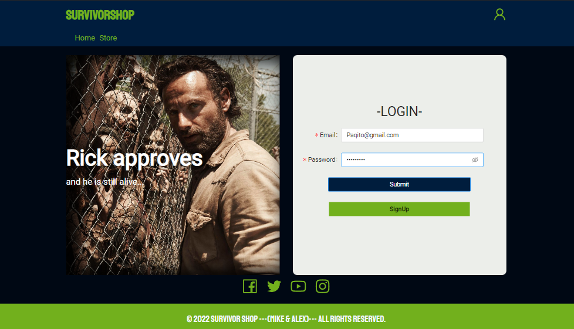
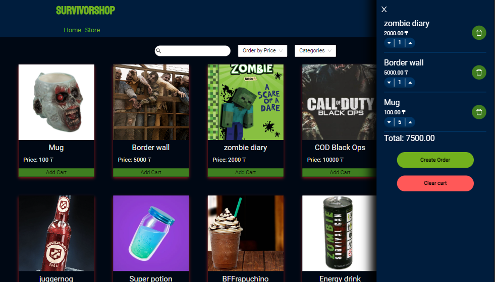
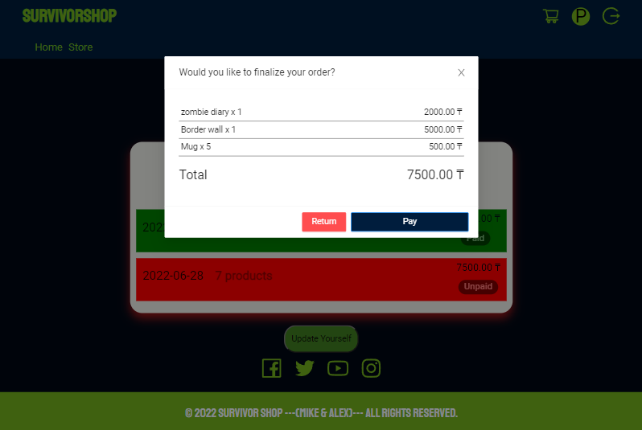
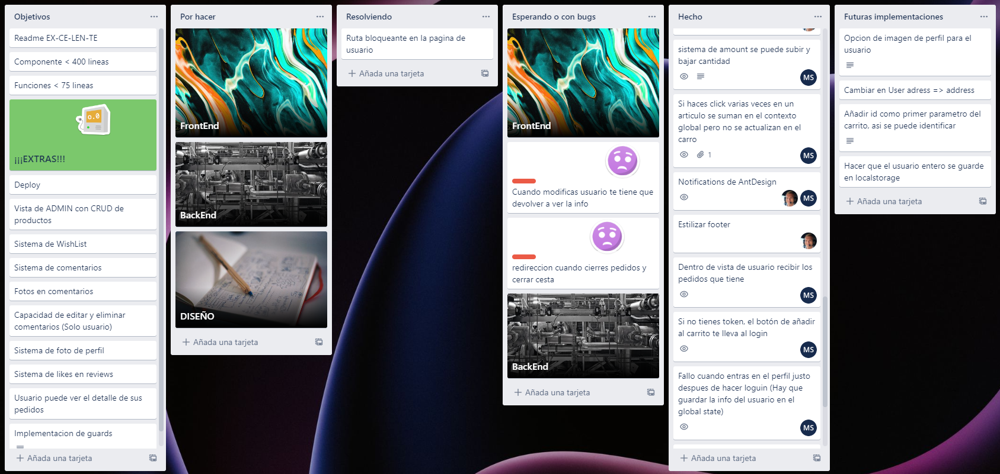
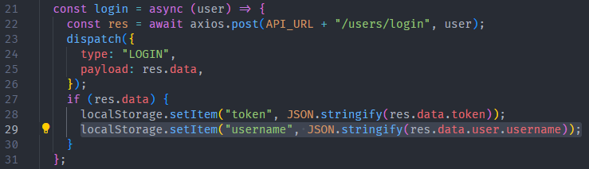
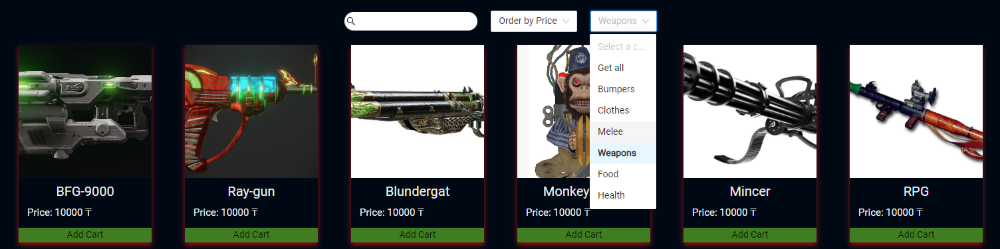
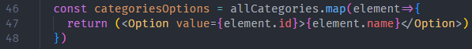
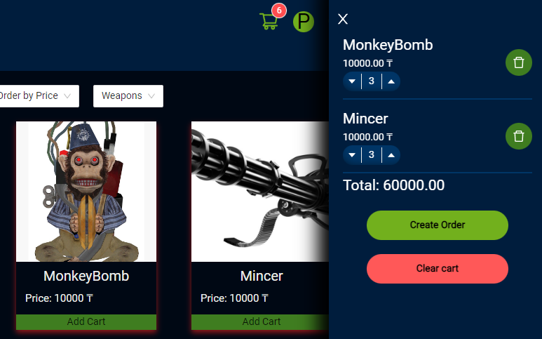

 #  <center>SURVIVOR-STORE</center> 

 ## :bookmark: Indice 

 - [Sobre el proyecto](#sobre-el-proyecto)

    - [Instalación y despliegue](#instalación-y-despliegue)

    - [Tecnologías utilizadas](#tecnologías-utilizadas)

    - [Origen](#origen)

    - [Concepto e inspiración](#concepto-e-inspiración)

    - [Organización](#organizaci%C3%B3n)

- [Retos presentados](#retos-presentados)

    - [Nombre en el Navbar](#nombre-en-el-navbar)

    - [Filtro por genero](#filtro-por-genero)

    - [Cantidad en la cesta](#cantidad-en-la-cesta)

    - [Buscador de productos](#)

- [Agradecimientos](#agradecimientos)

- [En el tintero](#en-el-tintero)

- [Autores](#autores)

# Sobre el proyecto

## Instalación y despliegue

- BackEnd

    1. Descargar el repositorio de ["Frikishop"](https://github.com/MrSetOne/Frikishop.git) usando `git clone https://github.com/MrSetOne/Frikishop.git` desde la terminal en la carpeta que desees.

    2. Una vez clonado el repositorio hay que instalar todos los paquetes que necesita el proyecto con `npm i` 

    3. Es necesario tener instalado de forma global el CLI de Sequelize, para ello introduce en la terminal `npm i sequelize-cli -g`

    4. Dentro de la carpeta config, debes copiarte el archivo llamado `config.example.json` y nombrarlo `config.json`, dentro tienes que introducir la siguiente información:

```JSON
{
    "development": {
        "username": "Your user", // Aquí introducir tu usuario de mysql 
        "password": "Your pass", //Introducir tu contraseña de mysql
        "database": "Your db", // Nombre de tu base de datos
        "host": "Your host", //Tu host
        "dialect": "mysql",
        "jwt_secret": "YourJWTPass", //La firma para verificar que el remitente del JWT es quien dice ser
        "auth": {
            "user": "yourMail@gmail.com", //Nombre de la dirección de email con la que quieras enviar el correo de confirmación para registrarte
            "pass": "YourPass" //Contraseña de esa cuenta de email
        }
    },
    ...
}
```

    5. Una vez introducida la información hay que levantar la base de datos con la siguiente secuencia `sequelize db:create` `sequelize db:migrate` `sequelize db:seed:all` 

    6. Dentro de la carpeta clonada de ["Frikishop"](https://github.com/MrSetOne/Frikishop.git) tienes que ejecutar el comando `npm start`

- FrontEnd

    1. Descargar el repositorio de ["SurvivorShop"](https://github.com/MrSetOne/SurvivorShop) usando `git clone https://github.com/MrSetOne/SurvivorShop.git` desde la terminal en la carpeta que desees.

    2. Una vez clonado el repositorio hay que instalar todos los paquetes que necesita el proyecto con `npm i`

    3. Dentro de la carpeta clonada de ["SurvivorShop"](https://github.com/MrSetOne/SurvivorShop) tienes que ejecutar el comando `npm start`

## Tecnologías utilizadas

```JavaScript
const project = {
    frontEnd:{
        main:["JavaScript","React","sass"],
        modules:[
            "react-router-dom",
            "antd",
            "@ant-design/icons",
            "axios",
            "normalize.css"
        ]
    },
    backEnd:{
        main:["JavaScript","MySQL","NodeJS","Express","Sequelize"],
        modules:[
            "Nodemailer",
            "Bcrypt",
            "Jsonwebtoken",
            "Multer",
            "Postman"
        ]
    }
} 
```

## Origen


El proyecto se origina en el BootCamp de FullStack en [TheBridge](https://www.thebridge.tech/), consiste en otorgar de frontEnd a un proyecto de backEnd anterior, consiguiendo así un proyecto Full-Stack. El objetivo principal es crear un e-commerce SPA (Single Page Application) funcional, usando Hooks y contexts.

## Concepto e inspiración

La idea fue realizar una tienda online en un apocalipsis zombie, donde puedes comprar todo lo necesario para sobrevivir o al menos intentarlo... Algunos productos están puestos de forma cómica, como por ejemplo "Zombie high heels" (¡Estás invitado a encontrarlo con nuestro buscador :D!), los precios están en Tenge kazajo (moneda de Kazajistán) y no hay envío, tu te las apañas para ir a recoger los artículos (Si sobrevives a los zombies :D)

### Inicio de sesión


### Tienda y carrito


### Pedidos y pago


## Organización

Para organizar las tareas hemos utilizado el aplicativo [Trello](https://trello.com/) con el que se puede gestionar cómodamente las tareas y "Tickets"

### Captura del Trello


# Retos presentados

## Nombre en el Navbar


Queríamos mostrar la inicial del usuario logueado dentro de la barra de navegación, el problema estaba en que en el localStorage solo almacenábamos el token actual, y no el username, entonces, al abrir la aplicación crasheaba, esto lo solucionamos haciendo que cuando se haga login se almacene el username en el localStorage.

### Captura de la solución



## Filtro por genero



El objetivo era hacer que el selector de categorías tuviese tantas opciones como categorías en el servidor, para esto hacemos primero una llamada al servidor que nos devuelve todas las opciones y mapeamos el resultado de la siguiente forma:



Así logramos que cada opción tenga su nombre y como `value` su id, esto ultimo lo usaremos para una vez selecciones una opción se lance la llamada a la API y esta nos devuelva los artículos que pertenecen a esa categoría.

## Cantidad en la cesta



En un primer lugar tratamos de que las cantidades se manejaran con un estado local del componente `cart`, pero tras varios debugueos descubrimos que esto dificultaba el control de los estados, finalmente optamos por usar en estado global para manejarlo, de esta forma nos asegurábamos la sincronización completa en todos los componentes.


## Buscador de productos

¡¡¡ ESPERANDO A ALEX !!!


# Agradecimientos

Agradecer a nuestros profesores [Sofia](https://github.com/SofiaPinilla) [Germán](https://github.com/GeerDev) e [Ivan](https://github.com/ivanpuebla10) por enseñarnos a usar React y su paciencia con nosotros. También agradecer a todos mis compañeros del BootCamp por siempre estar ahí para aportar soluciones o simplemente un punto de vista critico.

# En el tintero

- Implementar imagen de perfil.

- Opción para varios carritos

- Lista de deseos

- Vista de Admin

- Sistema de comentarios

# Autores

### [Michael L. Sánchez](https://github.com/MrSetOne)

### [Alex Tebbitt](https://github.com/alextebbitt)