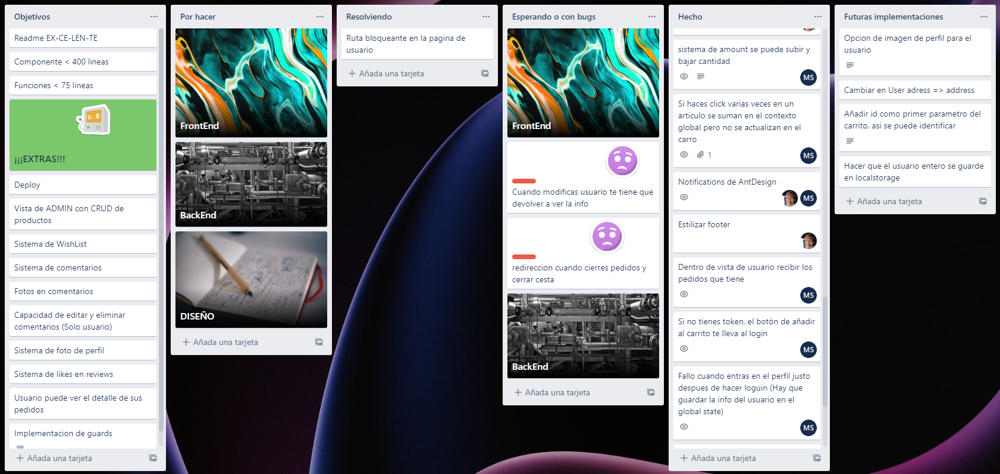
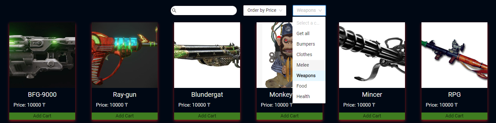
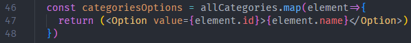

 #  <center>:hocho:SURVIVOR-SHOP:gun:</center> 

 ## :clipboard: Index 

 - [About the project](#about-the-project)

    - [Installation and deployment](#installation-and-deployment)

    - [Technologies used](#technologies-used)

    - [Source](#source)

    - [Concept and inspiration](#concept-and-inspiration)

    - [Organization](#organization)

- [Challenges presented](#challenges-presented)

    - [Name in the Navbar](#name-in-the-navbar)

    - [Category filter](#category-filter)

    - [Amount in the cart](#amount-in-the-cart)

    - [Product searchbar/filters](#product-searchbarfilters)

- [Acknowledgment](#acknowledgment)

- [Things we would have liked to have added](#things-we-would-have-liked-to-have-added)

- [Authors](#authors)

## :page_facing_up: About the project

This project unifies everything learned so far. We will develop an e-commerce where users will register, login, view products and create orders using the e-commerce API we created in the 1st Backend Project.

## :rocket: Installation and deployment

BackEnd

    1. Download the repository from ["Frikishop"](https://github.com/MrSetOne/Frikishop.git) using `git clone https://github.com/MrSetOne/Frikishop.git`  From the terimal in whichever folder you like.  

    2. Once the repository has been cloned, all the packages needed for the project must be installed with `npm i` 

    3. It is necessary to have the Sequelize CLI installed globally, to do this enter in the terminal `npm i sequelize-cli -g`

    4. Inside the config folder, you must copy the file called `config.example.json` and name it `config.json`, inside you have to enter the following information:
    
```JSON
{
    "development": {
        "username": "Your user", // Here enter your mysql username 
        "password": "Your pass", //Enter your mysql password
        "database": "Your db", // The name of your database
        "host": "Your host", //Your host
        "dialect": "mysql",
        "jwt_secret": "YourJWTPass", //The password to verify that the sender of the JWT is who they say they are
        "auth": {
            "user": "yourMail@gmail.com", //Name of the email address with which you want to send the confirmation email to register
            "pass": "YourPass" //Password of that email account
        }
    },
    ...
}
```

    5. Once the information has been entered, the database must be created with the following sequence `sequelize db:create` `sequelize db:migrate` `sequelize db:seed:all` 

    6. Inside the cloned folder of ["Frikishop"](https://github.com/MrSetOne/Frikishop.git) you have to run the command `npm start`

- FrontEnd

    1. Download the repository from ["SurvivorShop"](https://github.com/MrSetOne/SurvivorShop) using `git clone https://github.com/MrSetOne/SurvivorShop.git` From the terimal in whichever folder you like.

    2. Once the repository is cloned, you have to install all the packages that the project needs with `npm i`

    3. Inside the cloned folder of ["SurvivorShop"](https://github.com/MrSetOne/SurvivorShop) you have to run the command `npm start`

## :wrench: Technologies used

```JavaScript
const project = {
    frontEnd:{
        main:["JavaScript","React","sass"],
        modules:[
            "react-router-dom",
            "antd",
            "@ant-design/icons",
            "axios",
            "normalize.css"
        ]
    },
    backEnd:{
        main:["JavaScript","MySQL","NodeJS","Express","Sequelize"],
        modules:[
            "Nodemailer",
            "Bcrypt",
            "Jsonwebtoken",
            "Multer",
            "Postman"
        ]
    }
} 
```
 ## :mag: Source


The project originates from the FullStack bootcamp at [TheBridge](https://www.thebridge.tech/), It consists of transferring the frontend to a previous backend project, thus achieving a Full-Stack project. The main objective is to create a functional e-commerce SPA (Single Page Application), using Hooks and Contexts.

## :black_nib: Concept and inspiration

The idea was to make an online store in a zombie apocalypse, where you can buy everything you need to survive or at least try... Some products are placed in a comical way, such as "Zombie high heels" (You are invited to find it with our search engine :D!) The prices are in Kazakh Tenge (Kazakhstan's currency) and there is no shipping, you need to pick up the items (If you survive the zombies :D)

### Log in page


### Store and shopping cart


### Orders and payments


## :clipboard: Organization

To organize the tasks we have used the application [Trello](https://trello.com/) with which you can comfortably manage tasks and "Tickets"

### Screenshot of Trello



# :bomb: Challenges presented

## Name in the Navbar


We wanted to show the first letter of the user's name inside the navigation bar, the problem was that in the localStorage we only stored the current token, and not the username, so when opening the application it crashed, we solved this by making sure that when the user logged in, the username is stored in localStorage.

### Screenshot of the solution


## Category filter



The objective was to make the category selector have as many options as there are categories on the server, for this we first make a call to the server that returns all the options and we map the result as follows:



Así logramos que cada opcion tenga su nombre y como `value` su id, esto ultimo lo usaremos para una vez selecciones una opcion se lance la llamada a la API y esta nos devuelva los articulos que pertenecen a esa categoria.

This way we made that each option has its name and its id as `value`, the latter we will use so that once you select an option, the API call is launched and it returns the articles that belong to that category.

## Amount in the cart 


In the first place we tried to have the amounts handled with a local state of the `cart` component, but after several debugs we discovered that this made it difficult to control the states. Finally, we chose to use the global state to handle it, this way we made sure full synchronization across all components.


## Product searchbar/filters

For this we created a filter next to the search bar for the most expensive products to the least expensive and vice versa. originally we used the API, but we realized that when combined with the category filter there was a bug. To solve this we removed the api and used a .sort() method. This is a good fix for when you only have a small amount of products, but if we were to have a thousands of products, the .sort method would take a long time to load all of the products. 


# :green_heart: Acknowledgment

We would like to thank our teachers [Sofia](https://github.com/SofiaPinilla) [Germán](https://github.com/GeerDev) and [Ivan](https://github.com/ivanpuebla10) for teaching us React and for their pacience with us. We would also like to thank all of our classmates from the Bootcamp for always being there to help us resolve problems or simply for giving us some constructive critism.

# :pencil2: Things we would have liked to have added

- Implement profile image.

- Option for several carts

- Wish list

- Admin View

- Comment system


# Authors

### :point_right: [Michael L. Sánchez](https://github.com/MrSetOne) :point_left:

### :point_right: [Alex Tebbitt](https://github.com/alextebbitt) :point_left:


 ### <center>Readme in:</center>

 ### <center>[ENG](#)  |  [ESP](./README-ESP.md)</center>
